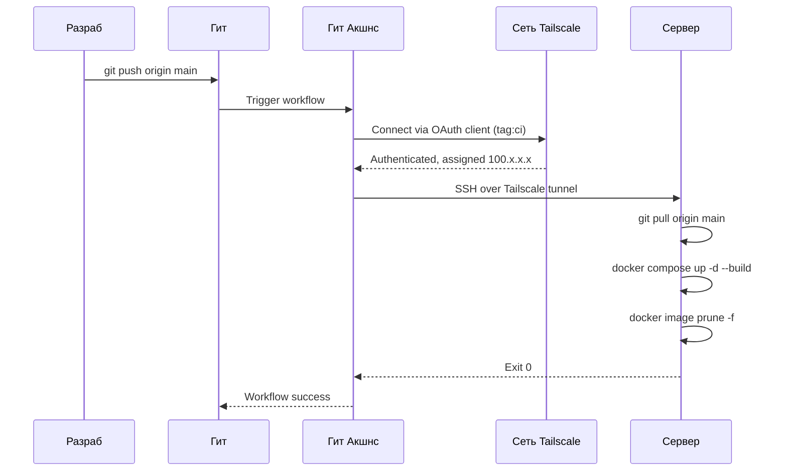

# Linkoo — Платформа Цифровых Визиток

<div align="center">


</div>

---

Платформа для создания и распространения цифровых визиток. Поддерживает гостевой режим с хранением данных в URL и авторизованный режим с постоянным хранилищем. Фронтенд собирается в статику и раздаётся через Nginx.

## Архитектура

```
Client
  └── HTTPS
        └── Cloud Reverse Proxy (VPS)
                  └── Tailscale VPN
                            └── Home Server
                                  ├── frontend  (Nginx, :80)
                                  ├── backend   (Node.js, :3001)
                                  └── mongodb   (:27017)
```

Входящие соединения принимает облачный прокси. Прямой доступ к серверу закрыт — трафик проходит только через зашифрованный Tailscale-туннель.

## CI/CD Пайплайн



Деплой запускается автоматически при пуше в `main`. Подключение к серверу происходит через Tailscale — внешние порты не открываются.

## Фичи

- **Guest mode** — визитки без регистрации, данные упакованы в URL через LZ-String
- **Authenticated mode** — OAuth через Google, VK, Discord, GitHub
- **Themes** — набор встроенных тем и поддержка кастомных
- **Tiered accounts** — Free (1 визитка) и Paid (без ограничений + custom domains)
- **Fully typed** — строгий TypeScript по всему проекту

## Стек технологий

| Уровень | Технология |
|---|---|
| Framework | React 19 + Vite |
| Language | TypeScript |
| Styling | TailwindCSS |
| UI Components | Radix UI + shadcn/ui |
| HTTP | Axios |
| Routing | React Router |
| URL Compression | LZ-String |
| Server | Nginx (Alpine) |
| Container | Docker multi-stage build |

## Подготовка

- Node.js 20+
- npm

### Установка

```bash
npm install
```

### Настройка

Создайте `.env` в корне проекта:

```env
VITE_API_URL=http://localhost:3001/api
```

### Разработка

```bash
npm run dev
```

### Продакшн

```bash
npm run build
npm run preview
```

## Docker

Образ собирается в три стадии: установка зависимостей, сборка приложения, финальный Nginx-образ со статикой. Node.js и `node_modules` в финальный образ не попадают.

```bash
# Сборка образа
docker build -t linkoo-frontend .

# Запуск
docker run -d -p 80:80 linkoo-frontend
```

или

Через Docker Compose:

```bash
docker compose up -d --build frontend
```

## Deployment

Деплой полностью автоматизирован через GitHub Actions + Tailscale. При пуше в `main` сервер сам подтягивает изменения и пересобирает контейнер.

Workflow срабатывает только при изменениях в:

```
frontend/**
docker-compose.yml
nginx.conf
```

Изменения в `*.md`, `docs/` и конфигурационных файлах деплой не триггерят.

## Related

- [linkoo-backend](https://github.com/addavriance/linkoo_backend) — API сервер
